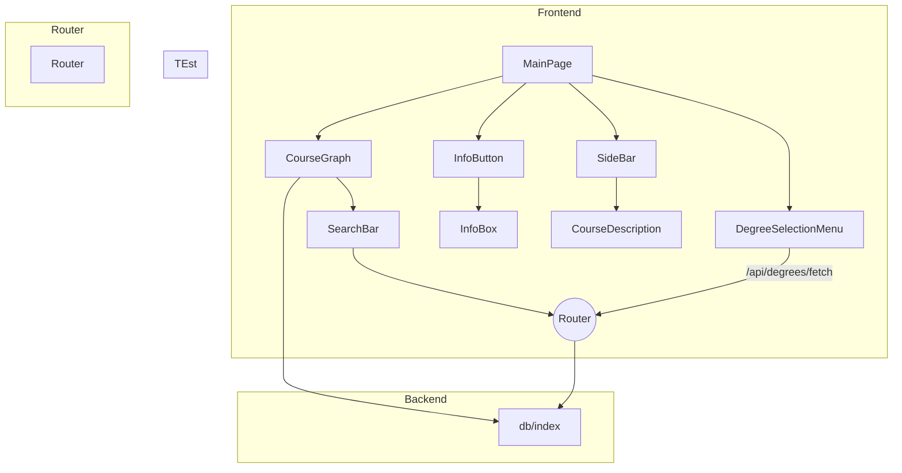

# 16.5. Architecture of the program WIP

```mermaid
flowchart TD
    subgraph Frontend
    A["MainPage"]
    A --> B["CourseGraph"]
    A --> C["DegreeSelectionMenu"]
    B --> D["SearchBar"]
    A --> E["InfoButton"]
    E --> F["InfoBox"]
    A --> G["SideBar"]
    G --> H["CourseDescription"]

    C --"/api/degrees/fetch"--> I
    D --> I
    end

    subgraph TEst
    I(("Router"))
    end

    subgraph Backend    
    I --> K
    B --> K["db/index"]
    end

    subgraph Router
    J["Router"]
    end
```
