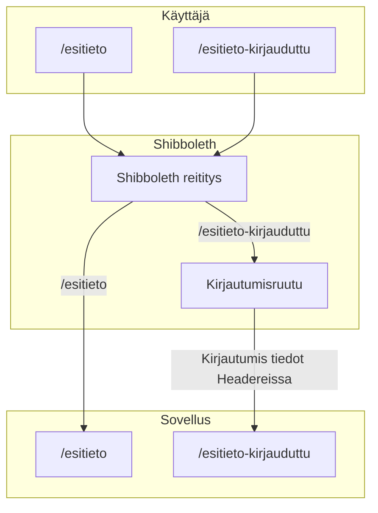

# Shibboleth
Shibboleth on Helsingin yliopiston käyttämä Single sign-on (SSO) kirjautumissovellus. Sovelluksemme käyttää Shibbolethia, mutta ei tällä hetkellä hyödynnä sen kertakirjautumista. Tämä olisi kuitenkin tarkoitus toteuttaa, jotta voimme hyödyntää kirjautumisen tuomia hyötyjä.

Sovelluksen toiminta Shibbolethin kautta:

Kuvaajasta näkyy, että ennen kuin haku pääsee sovelluksen ympäristöön, se kulkee Shibbolethin läpi. Riippuen kumpaan polkuun mennään, Shibboleth ohjaa joko suoraan sovellukseen tai sitten ensin Shibbolethin kirjautumissivulle. Kirjautuneena Shibboleth lisää headereihin kirjautumistiedot. Sovelluksessa on Middleware, joka ylläpitää sovellukselle kirjautumistietoja.

Tällä hetkellä /esitieto-kirjauduttu polkua ei ole toteutettu sovelluksen puolella ja siis kirjautuminen ei ole mahdollista. Tämän lisäksi Axios baseURL on asetettu /esitieto. Tämä pitää muuttaa, kun aletaan toteuttamaan kirjautumista.
