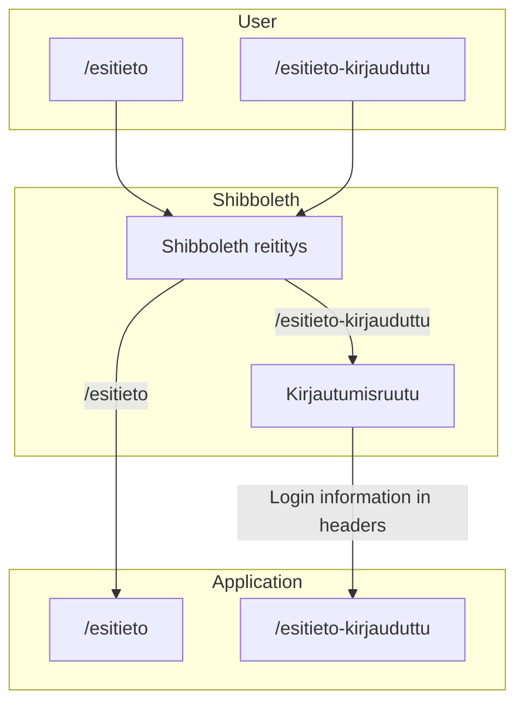

# Shibboleth
Shibboleth is a Single Sign-On (SSO) services that the University of Helsinki uses in many of their tools. Our application uses Shibboleth but isin't currently using the SSO services. Enabling the possibility to login is one of the next steps for this project.

How routing works for the application:

As you can see from the above diagram, all traffic passes through Shibboleth before it reaches our application. Depending on which route you are using Shibboleth will redirect you to a login screen. When logged in, Shibboleth will pass the login credentials as headers in the requests. Our Middleware strips this info out of the headers. (The middleware might not be working currently as it has been never tested.)

Currently the /esitieto-kirjauduttu path is not in use as there hasn't been any reason to configure it yet. At this time Axios baseUrl is set to /esitieto so it must be changed when we start work on the login features.
