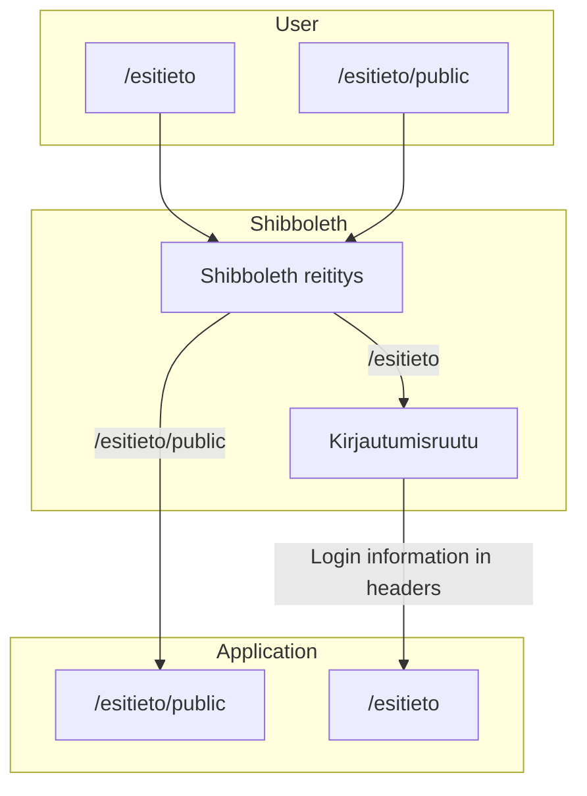

# Shibboleth
Shibboleth is a Single Sign-On (SSO) services that the University of Helsinki uses in many of their tools. Our application uses Shibboleth.

How routing works for the application:

As you can see from the above diagram, all traffic passes through Shibboleth before it reaches our application. Depending on which route you are using Shibboleth will redirect you to a login screen. When logged in, Shibboleth will pass the login credentials as headers in the requests. Our Middleware strips this info out of the headers. (The middleware might not be working currently as it has been never tested.)

## Configuring Shibboleth
As an OHTU Project student you will have access to the [OpenShift ohtuprojekti-staging](https://console-openshift-console.apps.ocp-test-0.k8s.it.helsinki.fi/topology/ns/ohtuprojekti-staging?view=graph) 
environment. In the Topology view you can find a Shibboleth Pod:


Clicking the Pods hyperlink will bring you to the pods settings:


Here you will find httpd-config under Volumes. Clicking the hyperlink will open the config in "Details" view:


If you want to edit the config you will need to switch to the "YAML" side. When you scroll to the bottom of the config. It looks like this:

```
<Location /esitieto/start>
    Satisfy Any   
    Allow from all   
    AuthType None   
    Require all granted  

    ProxyPreserveHost On
    ProxyPass http://kurssiesitieto-staging:3001 retry=0 disablereuse=Off
    ProxyPassReverse http://kurssiesitieto-staging:3001
</Location>

<Location /esitieto/assets>
    Satisfy Any   
    Allow from all   
    AuthType None   
    Require all granted  

    ProxyPreserveHost On
    ProxyPass http://kurssiesitieto-staging:3001 retry=0 disablereuse=Off
    ProxyPassReverse http://kurssiesitieto-staging:3001
</Location>

<Location /esitieto/api>
    Satisfy Any   
    ShibUseHeaders On

    Allow from all   
    AuthType None   
    Require all granted  

    ProxyPreserveHost On
    ProxyPass http://kurssiesitieto-staging:3001/api retry=0 disablereuse=Off
    ProxyPassReverse http://kurssiesitieto-staging:3001/api
</Location>

<Location /esitieto>
    AuthType shibboleth
    ShibUseHeaders On
    ShibRequestSetting requireSession 1
    require shib-session

    ProxyPreserveHost On
    ProxyPass http://kurssiesitieto-staging:3001 retry=0 disablereuse=On
    ProxyPassReverse http://kurssiesitieto-staging:3001
</Location>

<Location /esitietologin>
    AuthType shibboleth
    ShibUseHeaders On
    ShibRequestSetting requireSession 1
    require shib-session

    ProxyPreserveHost On
    ProxyPass http://kurssiesitieto-staging:3001 retry=0 disablereuse=On
    ProxyPassReverse http://kurssiesitieto-staging:3001
</Location>

RedirectMatch ^/esitietologin$ https://kurssiesitieto-staging:3001/esitietologin?target=https://kurssiesitieto-staging:3001/esitieto/public
```

Here you can see /esitieto, /esitieto/public and /esitieto/api paths. The stuff inside determines if it is just a pass through route like /esitieto/public or a SSO route like /esitieto/api or /esitieto. Shibboleth config was created together with Toska-group.

**Every time you change the config you need to restart the Shibboleth pod**

### Restarting the Shibboleth pod
**This will Shutdown the service. Make sure it won't affect others work**

(You can check the httpd-config to see which apps use the service. At the time of writing this our app is the only one that uses the test Shibboleth pod)
1. Navigate to the pod in OpenShift Topology and select Details tab:
2. Press the arrow down to scale the pods to 0:


3. Press the arrow up to scale the pods to 1:


### Modifying the production Shibboleth config
You will not have access to the production environment so just contact Matti Luukkainen or other Toska contact that can do the change for you.

### Testing the login
When you go to the login route it should automatically prompt for hy test login. You can use ohtup_user as username and password or you can create more test accounts in [sp-registry](https://sp-registry.it.helsinki.fi/login/?next=/). Clicking the "https://shibboleth.ext.ocp-test-0.k8s.it.helsinki.fi" will show the test Shibboleth details. Under "Test Users" tab you will see all test users.
